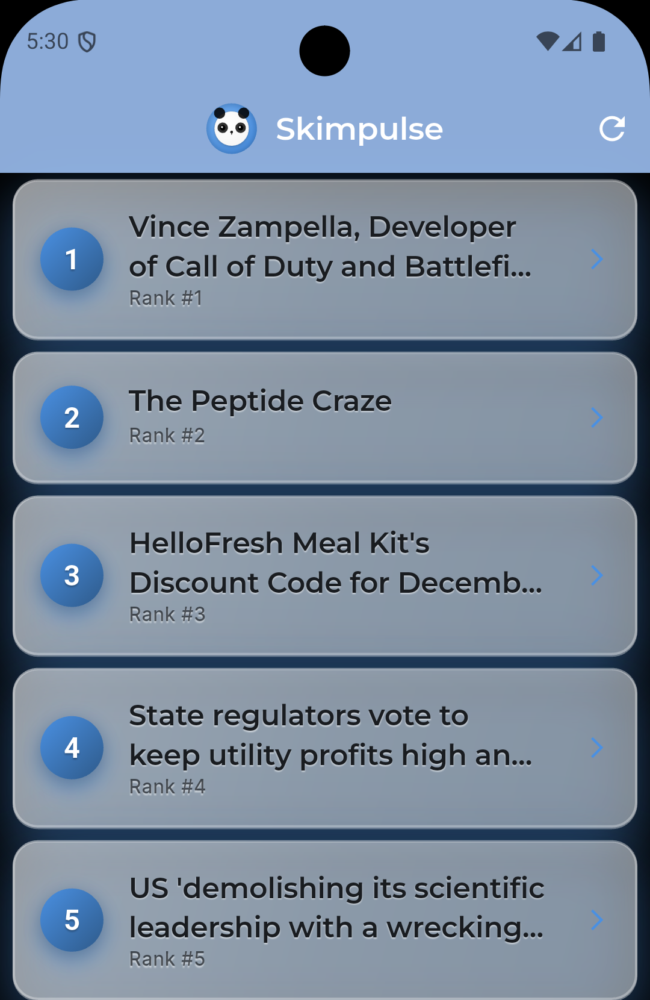
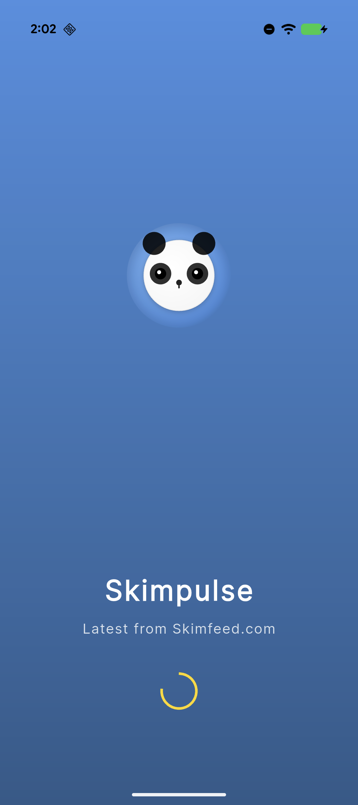
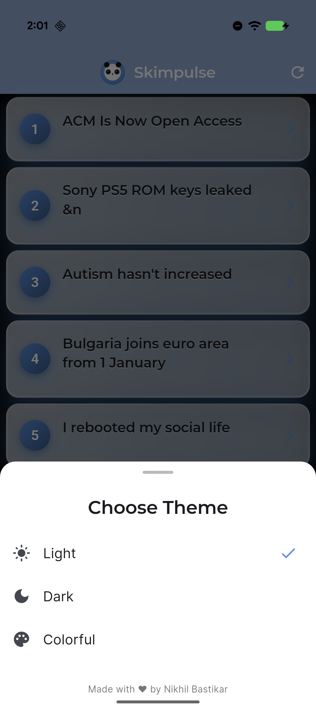
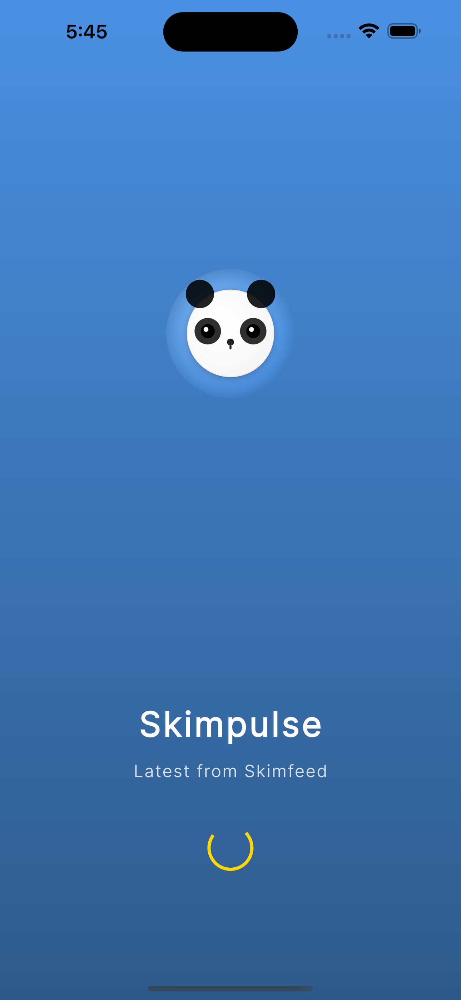
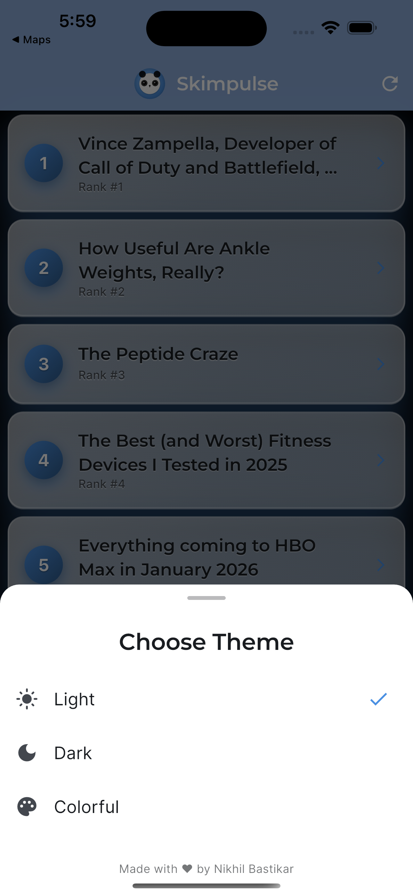

# Skimpulse

A modern mobile application for technology news and articles.

## Screenshots

### Android

  
  
  
  

### iOS

  
  
  
  

## Features

- Modern, intuitive interface
- Latest technology news
- Multiple theme options
- Smart sorting and filtering
- Fast and responsive

## Platform Support

Available on iOS, Android, and Web.

## Disclaimer

This application aggregates content from various technology news sources. All article content belongs to their respective owners.
